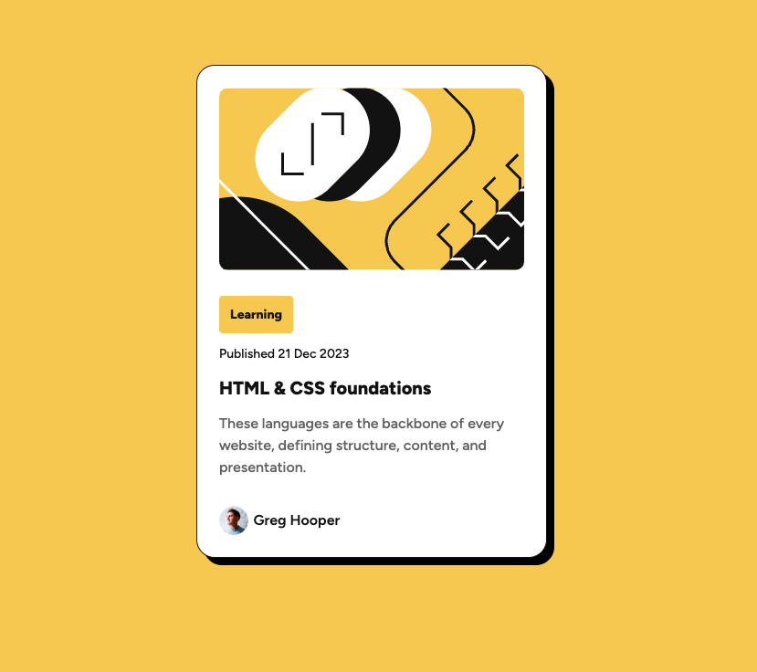

# Frontend Mentor - Blog preview card solution

This is a solution to the [Blog preview card challenge on Frontend Mentor](https://www.frontendmentor.io/challenges/blog-preview-card-ckPaj01IcS). Frontend Mentor challenges help you improve your coding skills by building realistic projects. 

## Table of contents

  - [The challenge](#the-challenge)
  - [Screenshot](#screenshot)
  - [Links](#links)
  - [Built with](#built-with)
  - [Author](#author)

## The challenge

Users should be able to:

- See hover and focus states for all interactive elements on the page

## Screenshot

## Links

- Solution URL: [https://www.frontendmentor.io/solutions/blog-preview-card-design-solution-U913-qPs-a](https://www.frontendmentor.io/solutions/blog-preview-card-design-solution-U913-qPs-a)
- Live Site URL: [https://baristunar.github.io/blog-preview-card-design/](https://baristunar.github.io/blog-preview-card-design/)

## Built with

- Semantic HTML5 markup
- CSS custom properties
- Flexbox
- Css Clamp
- Mobile-first workflow

### Author

- Website - [www.baristunar.com](https://www.baristunar.com)
- Frontend Mentor - [@baristunar](https://www.frontendmentor.io/profile/baristunar)
- Twitter - [@baristunar](https://www.twitter.com/baristunar)